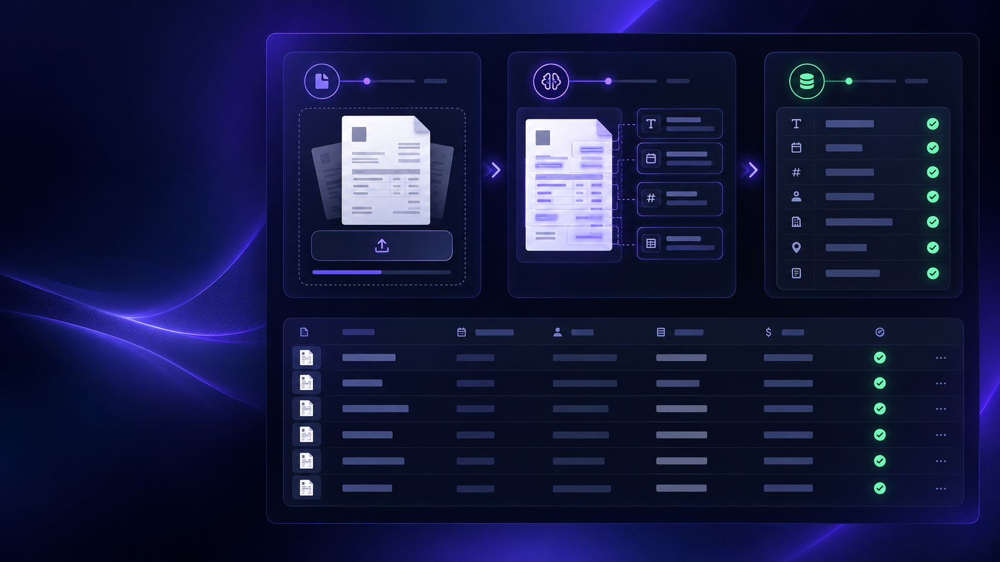

# DocumentAI — Automatización documental con IA

## Texto corto para tarjeta de portfolio

Plataforma full stack para cargar facturas en PDF, extraer sus datos automáticamente y guardarlos para revisión. Integra automatización visual con n8n, un microservicio Python para lectura de PDF y una API Java conectada a PostgreSQL.

## Descripción completa

DocumentAI transforma un flujo manual de carga de facturas en un proceso automatizado. El usuario sube un PDF desde una interfaz web; n8n orquesta el proceso, un servicio FastAPI extrae proveedor, fecha, número y total, y una API Spring Boot valida y persiste el resultado en PostgreSQL.

El proyecto está preparado para una demostración pública en infraestructura gratuita: el dashboard detecta cuando los servicios están suspendidos, los despierta automáticamente y habilita la carga cuando están listos.

## Problema que resuelve

Reduce la carga manual de información de facturas y deja una base para escalar hacia validaciones contables, revisión humana, alertas y clasificación documental.

## Funcionalidades destacadas

- Carga de facturas PDF desde una interfaz web.
- Extracción automática de proveedor, fecha, número de factura y total.
- Orquestación visual del flujo con n8n.
- Persistencia y consulta de documentos procesados.
- Estado visual de disponibilidad y reintentos automáticos ante servicios gratuitos suspendidos.
- Panel de documentos recientes para revisar los resultados.

## Stack tecnológico

| Área | Tecnologías |
| --- | --- |
| Frontend | HTML, CSS, JavaScript, Vercel |
| Automatización | n8n |
| Extracción documental | Python, FastAPI, pypdf |
| Backend | Java 21, Spring Boot, Spring Data JPA |
| Base de datos | PostgreSQL, Neon |
| Despliegue | Render, Vercel, Docker |

## Arquitectura

`Dashboard web → n8n → Extractor FastAPI → API Spring Boot → PostgreSQL (Neon)`

## Links para publicar

- Demo: https://document-ai-automation-dashboard.vercel.app/
- Repositorio: https://github.com/H1r0waz/document-ai-automation
- API: https://document-ai-automation.onrender.com/api/documents
- Documentación del extractor: https://document-extractor-e3h1.onrender.com/docs

## Texto para LinkedIn

Presento **DocumentAI**, un proyecto full stack de automatización documental con IA.

La aplicación permite subir facturas en PDF, extraer automáticamente datos clave y guardarlos para su revisión. Construí el flujo con **n8n**, un extractor en **Python/FastAPI**, una API en **Java/Spring Boot** y **PostgreSQL**, con despliegue en **Vercel, Render y Neon**.

Además, el dashboard detecta y despierta automáticamente los servicios gratuitos cuando están suspendidos, para que la experiencia de demostración sea más fluida.

Demo: https://document-ai-automation-dashboard.vercel.app/

#Java #SpringBoot #Python #FastAPI #n8n #PostgreSQL #Docker #Automation #Portfolio
